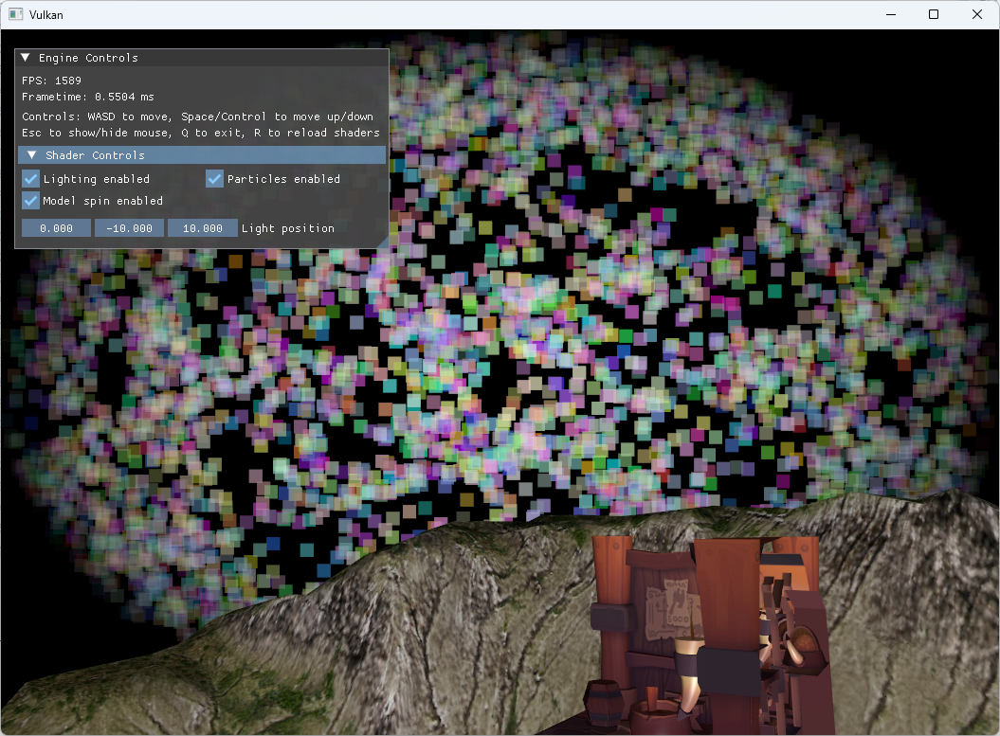

# Vulkan rendering engine

---

Rendering engine project using Vulkan 1.4, C++23, C++20 modules, and HLSL shaders. The goal of the
project is to learn more about graphics programming, various render techniques, low-level
graphics APIs, and their more modern features.

Builds and runs on Windows and Mac, with Mac generally having some delays in terms of features - meaning
sometimes something gets added to Windows's version that breaks Mac until fixed later on. Notably, Mac
doesn't use standard library modules, because its stdlib has no support for them whatsoever.

## Currently implemented features

- Resource system for textures and models
- Interactive 3D camera
- Basic lighting model
- Shader hot reloading
- Bindless texture access
- Interactive UI
- Compute particles
- HLSL shader compiler

For a more comprehensive list of planned and implemented features, check the [To-Do list](ToDoList.md) file.

## Examples

