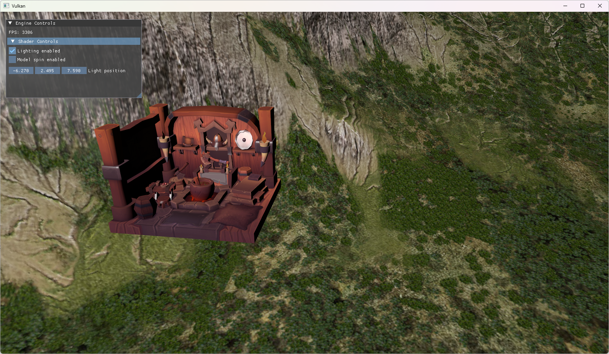

# Vulkan toy project

---

A repository for me playing around with Vulkan (and Vulkan's C++ bindings, to be more specific)
while making sense of CMake and C++ modules. Builds and runs on Windows and Mac (unfortunately couldn't get
Vulkan's modules to work on Mac though), with Mac generally having some delays in terms of features - meaning
sometimes something gets added to Windows's version that breaks Mac until fixed later on.

## Example

